# Grid

Electricity accountability for Nigerian households and landlords.

Grid records what your meter said and when the power was actually on, turns
that into consumption, cost and band compliance, and assembles the result into
a dispute pack a distribution company and a regulator will read.

<p align="center">
  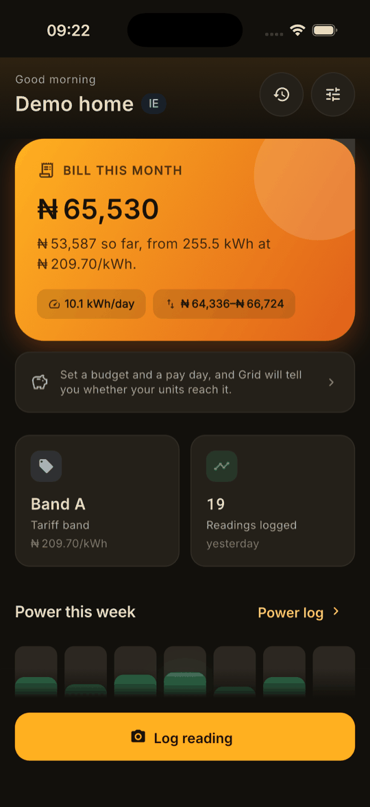
  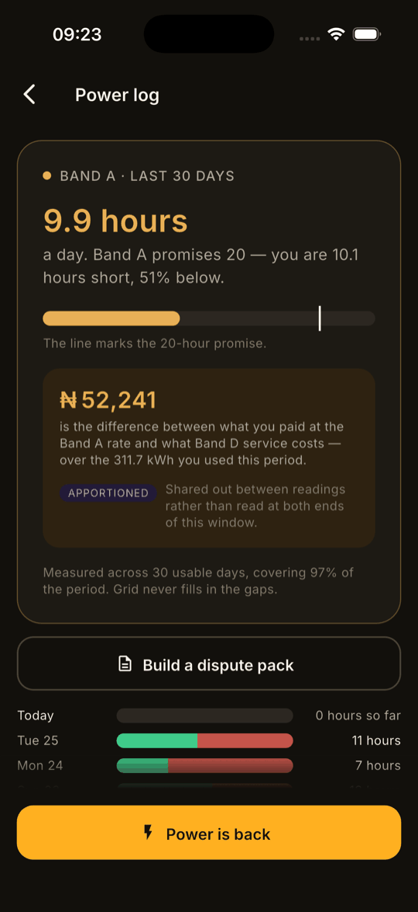
  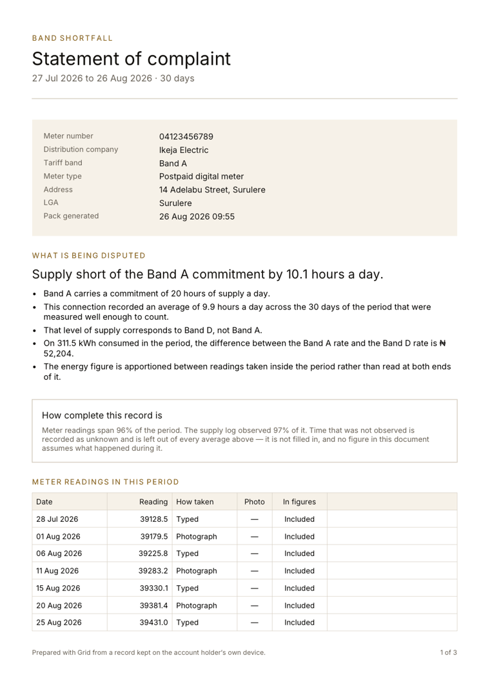
</p>

---

## 1. The problem

A Nigerian household disputing an electricity bill has nothing to dispute it
with. There is no reading history, no record of how long the power was actually
on, and no document anyone at a distribution company is obliged to look at. So
the bill gets paid, or the connection gets cut.

Since electricity supply was split into service bands, the gap has a shape. A
household on Band A pays roughly four times the Band D rate, and in exchange is
promised twenty hours of supply a day. When those hours do not arrive, the
difference between the two rates is money that changed hands for a service that
did not. Almost nobody can show that it did not.

The problem is evidential, not analytical:

> **The party that decides what you owe is the only party keeping a record of
> what you received.**

Grid is the second record. It lives on the customer's phone, it is written
before there is a dispute rather than after, and its central claim is not that
its figures are impressive but that they are checkable.

### What it is not

**Grid does not pay bills, buy units, or move money.** It observes, records,
computes and produces documents. There is no wallet, no vending integration and
no payment rail, and that boundary is load-bearing rather than a phase-one
simplification: the moment Grid takes a margin on a purchase, its warnings that
a vendor is overcharging stop being disinterested, and disinterest is the only
thing the dispute pack is actually built on.

**Grid does not tell you what it did not measure.** Time the phone did not
observe is recorded as `unknown`, reported as coverage on every figure derived
from it, and never interpolated into whichever state would make a better case.
This costs the product its most satisfying screens. It is the reason the packs
survive being challenged.

**Grid has no server.** Everything is on the device. There is no account, no
sign-in and nothing to breach, and phases 0–5 are a complete product built that
way on purpose — you cannot accidentally introduce a network dependency into an
application that has no network.

---

## 2. How it works

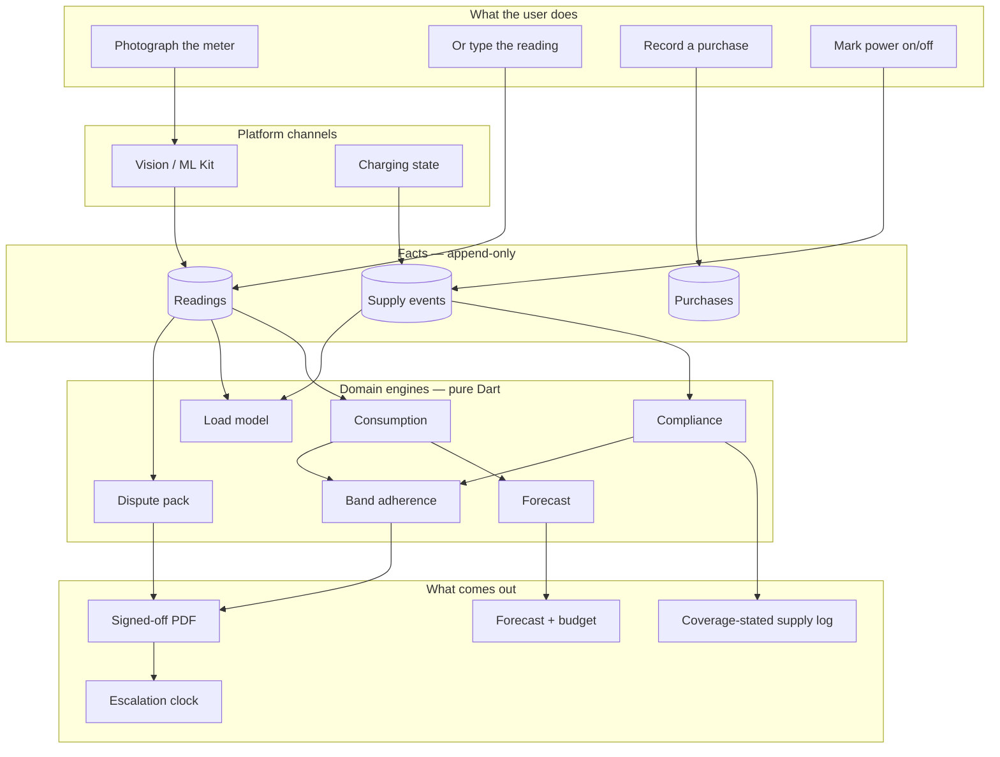

The two halves that matter are **facts** and **state**, and they are governed
by opposite rules.

A **fact** is something that was observed: a meter reading, a purchase, a period
during which the power was on. Facts are append-only. There is no update path
and no delete path anywhere in the application — a correction writes a new row
and marks the original superseded, and the original survives. This is not
fastidiousness. A record that its own author can quietly rewrite is not
evidence, and the whole product rests on the pack being something a third party
can trust.

**State** is a description of how things are now: the meter's tariff band, an
appliance inventory, a budget, where a complaint has got to. State changes, last
write wins, and nobody is misled by that.

### What a reading becomes

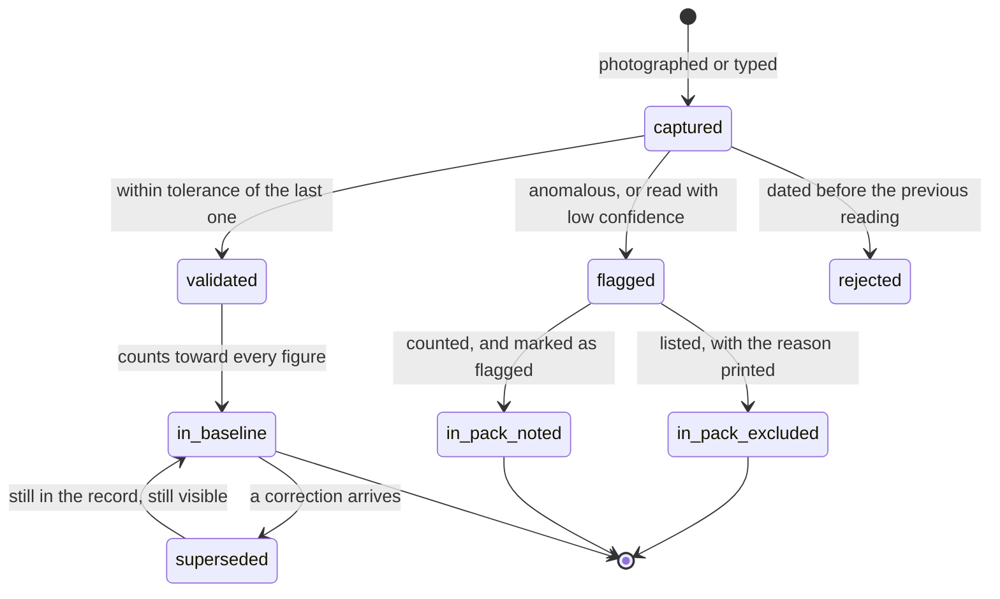

Two edges carry most of the judgement.

**`rejected` has exactly one cause.** A reading dated before the one that
precedes it corrupts every derived figure, so it is the single case where the
app refuses input outright. Everything else warns and offers a way forward —
validation that blocks trains people to work around it, and a user who works
around the validation stops logging.

**`flagged` splits two ways, and never a third.** A flag that disqualifies a
reading from the baseline (an implausible jump, a meter change) excludes it from
the pack's figures, and the pack prints why. A flag that does not (a photograph
the recogniser was unsure about, a value the user corrected) leaves the reading
counted — but the pack still marks it. There is deliberately no path where a
flagged reading appears in a dispute pack as though it were clean, because that
is precisely the thing an opposing party would find.

---

## 3. The app

Fourteen screens, all of them offline, all of them on one device.

### Getting set up

Onboarding asks three questions and then stops. There is no account to create,
nothing to verify and nothing to skip, because there is no server to register
with. A user who does not know their tariff band — most of them — can say so and
have it estimated from measured supply later.

<p align="center">
  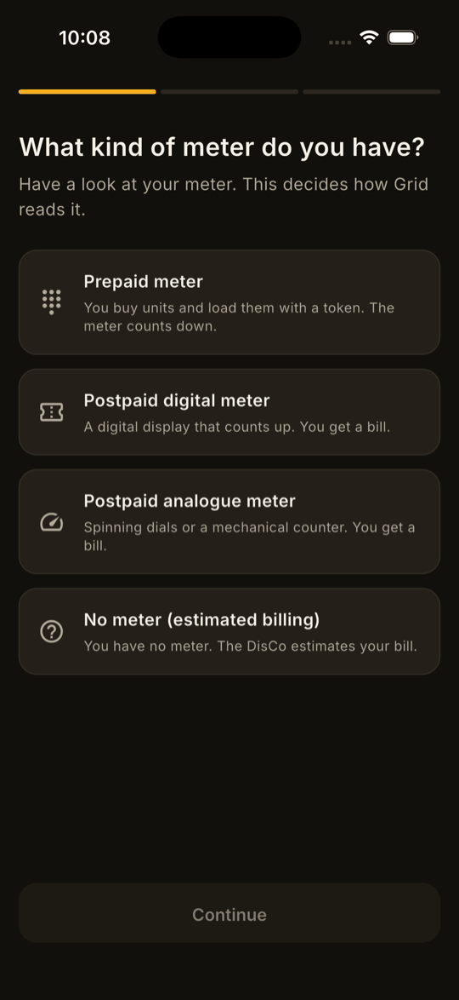
  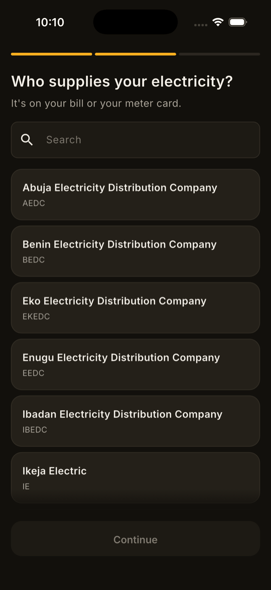
  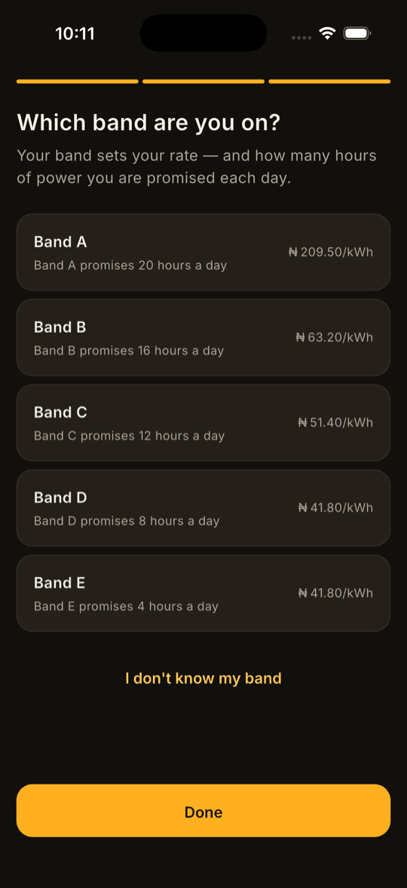
  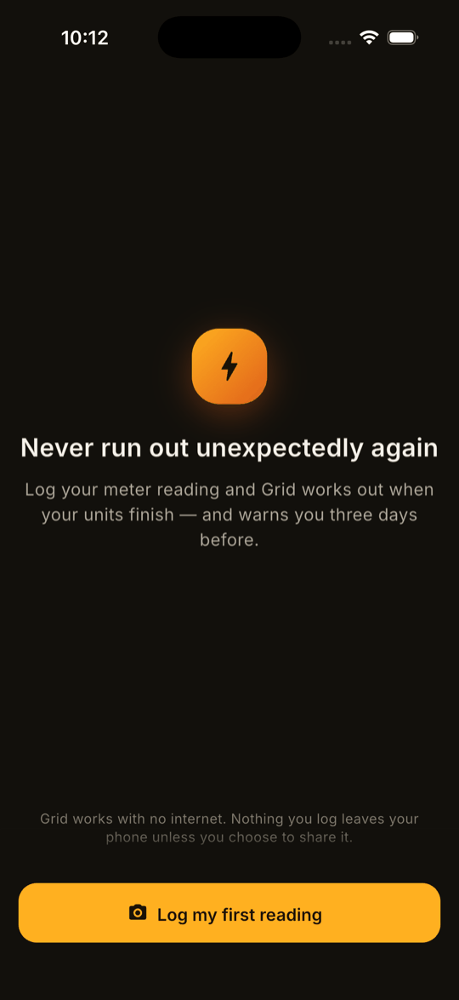
</p>

The meter type is the first question because it decides everything downstream: a
prepaid meter counts **down** and a postpaid meter counts **up**, and getting
that backwards inverts every consumption figure in the product.

### Logging a reading

<p align="center">
  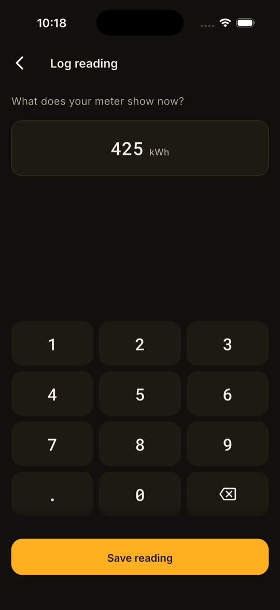
  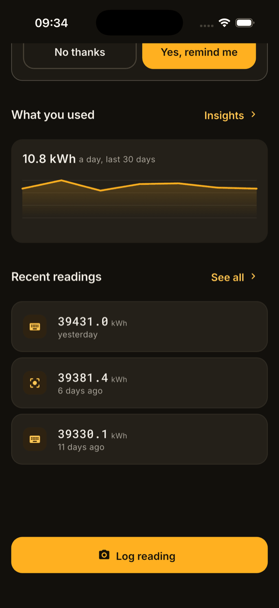
</p>

The meter is outdoors, at night, often in the rain, and frequently reached with
one hand while the other holds a torch. That is the constraint the entire design
system is sized against — targets are 64 dp in the capture flow rather than the
48 dp minimum, and the figure the user is checking against a physical meter face
is set in a tabular monospace so the digits line up in a column.

The camera path is offered only where recognition actually works. A camera
button that falls straight through to manual entry is worse than no camera
button, so `ocrAvailableProvider` decides which one the screen shows.

### What it tells you

<p align="center">
  
  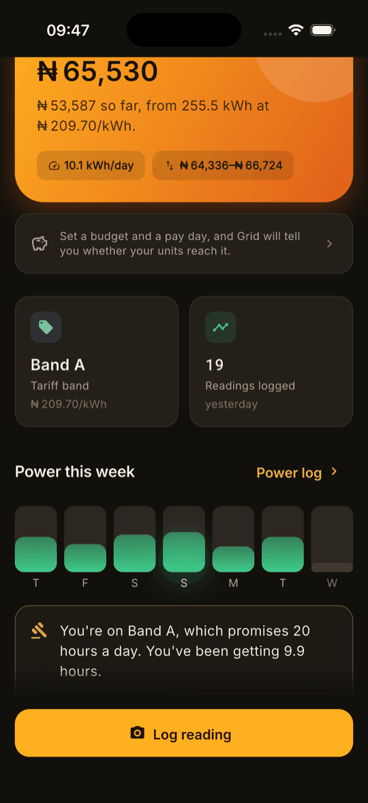
</p>

The headline figure is the **whole cycle** — what has been used plus what the
rest of the month is expected to add — with the measured part stated underneath
where it can be checked against the meter. It said "Bill so far this month" over
a number covering only the days still to come for most of this project's life,
which is discussed in [§6](#6-correctness-notes).

Budget mode reframes the forecast against the date money next arrives. "Your
units finish on the 24th" is information; "your units finish four days before
you are paid, and ₦2,300 closes the gap" is a decision. It is the one feature
here for the days when nothing is wrong.

### The band shortfall

<p align="center">
  
</p>

This is the strongest single thing Grid can produce, and it is almost entirely
subtraction over data the supply log already holds: the promised hours, the
measured hours, the band that level of supply actually corresponds to, and the
difference between the two rates over the energy consumed in the same window.

The card has three states and renders all three. A month Grid did not observe
well enough returns `AdherenceUnknown` and says so with the same prominence as a
proven shortfall — a card that appears only when it has bad news cannot be
trusted when it says nothing.

The `APPORTIONED` marker is not decoration. Where readings are further apart
than the window, the energy figure is shared out between them rather than read
off the meter at each end, and the pack says so in those words.

### Where the units go

<p align="center">
  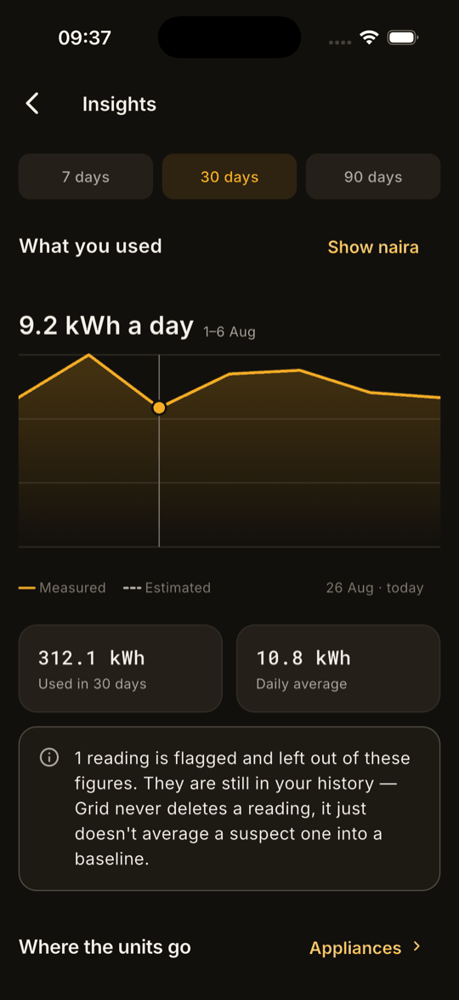
  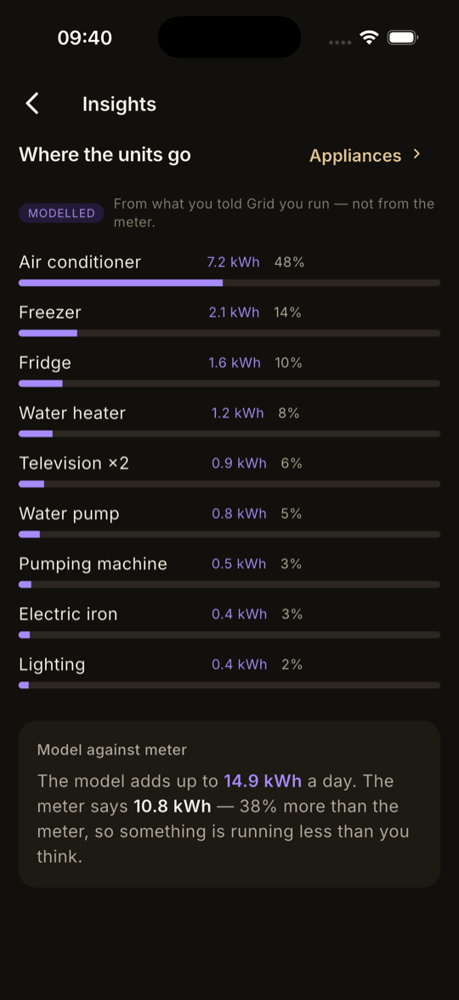
</p>

The chart is painted by hand rather than plotted by a package, for two reasons.
The measured-versus-modelled distinction is load-bearing here and is not
something chart libraries model — hanging it off a colour callback in someone
else's API is a fragile place for a rule that decides whether a user walks into
a dispute they lose. And the low-end Android in the test matrix has to hold
60 fps while a finger drags across it, which is easier to guarantee when the
paint path is a few dozen readable lines.

It plots **one point per reading interval**, not per day. Readings come four to
six days apart, so a daily series is apportioned all the way through, the whole
line renders as estimated, and a signal that is always on stops being a signal.
An interval is a measured rate over a span with a reading at each end.

Everything in the attribution list is violet, dashed or explicitly labelled
`MODELLED`, and the reconciliation against the meter is printed whether or not
it flatters the model. A model that reports itself only when it agrees with the
measurement is a decoration.

### The pack

<p align="center">
  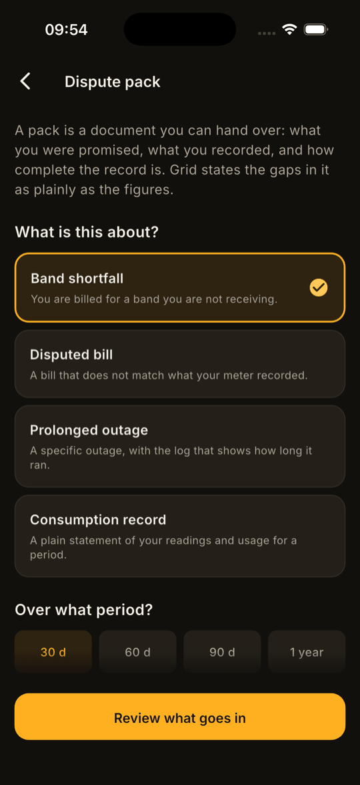
  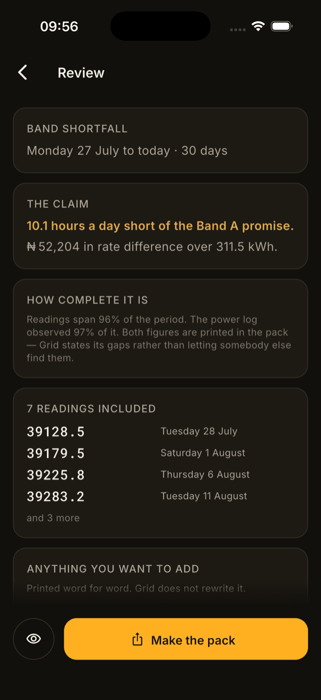
</p>

Eligibility is evaluated against the choice as it is made, not at the end. A
user who assembles a pack and is told at the final step that a fortnight of data
is required has been wasted; one told at the first step knows what to do about
it.

The review screen shows the excluded readings with the same weight as the
included ones. Somebody who is going to be asked about a flagged reading at a
counter should meet it here first.

<p align="center">
  
</p>

The pack states its own completeness in its own words, before the figures it
qualifies. Every reading in the period appears — included or excluded — and the
reason is printed against each one that is not counted. A pack that quietly
drops the inconvenient readings can be accused of exactly that, and the
accusation would be true.

### After it is handed over

<p align="center">
  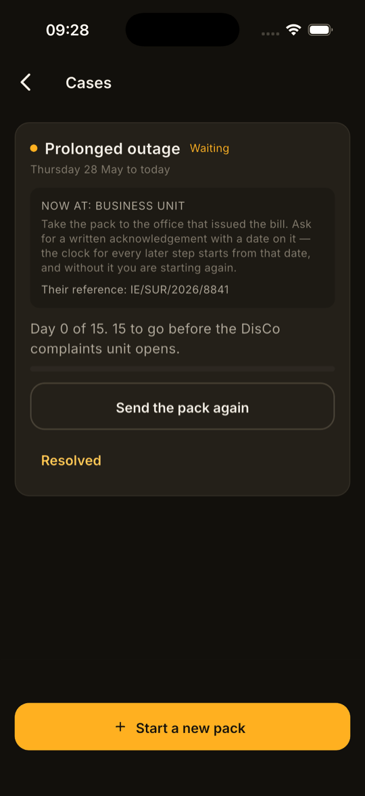
  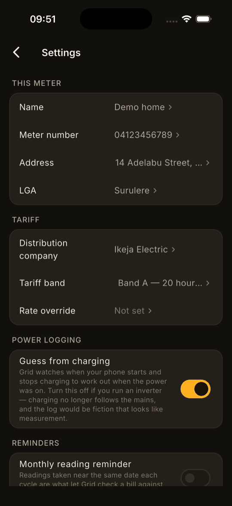
</p>

Most complaints die at the first office — not because the case was weak but
because nobody was counting the days and nobody knew there was a step above it.
A case opens when a pack is shared (not when it is previewed: a preview is
somebody checking their own work, and a case list full of drafts is a case list
nobody trusts), and Grid counts.

---

## 4. What each layer does

### `lib/domain` — the rules, with no Flutter in them

The engines are the product; the widgets render what the engines decide. This
directory imports nothing from `package:flutter`, and `make domain-purity`
fails the build if it ever does — so the logic that decides whether a household
has a case can be read and tested without a device in the loop.

They carry a **95% line-coverage gate** and nothing else in the repository does,
because nothing else in the repository can produce a wrong number that somebody
takes to a regulator.

**Money and energy are integers.** Kobo and milli-kWh, in extension types that
cost nothing at runtime:

```dart
extension type const Naira._(int kobo) {
  Naira operator +(Naira other) => Naira._(kobo + other.kobo);
  ...
}
```

A float in a figure that ends up in a dispute pack is a rounding error somebody
has to defend. The classic demonstration — `0.1 + 0.2 != 0.3` — is a test in
`units_test.dart` rather than a comment, and it caught a real one: `Kwh.format`
originally rounded through `toStringAsFixed`, which reintroduced in the last
inch exactly the error the type exists to prevent, rendering 42.05 as "42.0".

### `domain/services/consumption_engine.dart` — what was actually used

Handles the prepaid/postpaid direction split, purchases landing mid-interval,
meter rollover, exclusion of flagged readings, and per-day apportioning — and
reports coverage alongside every result.

**A windowed series is that window.** `series()` clips its intervals to the
dates it is given, apportioning any interval that straddles the boundary by
overlap. That has to be enforced here rather than at each call site, and the
reason is in [§6](#6-correctness-notes): it was not, and the same mistake
produced two wrong figures in one morning.

Daily interpolation conserves energy — the per-day figures sum to the interval
total, asserted by test. An earlier version allocated a full day's consumption
to every calendar day an interval touched, which roughly doubled every monthly
total and looked entirely plausible on screen.

### `domain/services/compliance_engine.dart` — hours, and honesty about them

Turns supply events into per-day availability with the coverage that produced
it. Unobserved minutes are `unknown` and are excluded from both numerator and
denominator; a day below 60% coverage is not usable for an average at all.

Each day carries **`observableMinutes`** — how much of it the clock has actually
reached. Without that, today is scored against twenty-four hours it has not had
yet: at 03:00 a perfectly observed morning reports 12% coverage, renders as "No
data", and drags the window average down far enough to threaten the coverage
floor that decides whether a case may be stated at all.

A day in progress is never averaged in as a whole day, however well observed.
Eight hours of power by lunchtime is not an eight-hour day.

### `domain/services/band_adherence_engine.dart` — the shortfall, in naira

Compliance answers *were you short*. This answers *by how much, and what is that
worth*, which is the form the question takes when it reaches someone who can act
on it.

It returns a sealed result — `AdherenceMet`, `AdherenceShortfall`,
`AdherenceUnknown` — and the UI is required to render all three. The tariff
table is injected as a function rather than imported, because the domain layer
may not reach into `data/`:

```dart
BandAdherence evaluate({
  required TariffBand billedBand,
  required SupplySummary summary,
  required Kwh energy,
  required Rate billedRate,
  required Rate? Function(TariffBand band) rateForBand,
  ...
});
```

Below the lowest published band it reports exactly that rather than rounding up
into Band E, and it declines to state an overpayment when the delivered band has
no rate — the hours are still measured when the money is not.

### `domain/services/forecast_engine.dart` — dates, never nulls

Prepaid depletion and postpaid cost projection, both as sealed results. There is
deliberately no nullable `DateTime` in this API: a UI cannot render "your units
finish on null" if the type system will not let it. `BalanceUnavailable` carries
how many more readings would make a forecast possible, so the empty state can
say "log two more" rather than "not enough data".

The confidence band widens with less history and with a longer horizon, both of
which genuinely increase uncertainty, and a thin projection is displayed as a
range rather than a figure. False precision on a bill projection destroys trust
the first time it is wrong.

### `domain/services/dispute_pack_engine.dart` — assembling the case

Decides everything the pack contains. The PDF layer adds nothing — a renderer
that computes is a renderer nobody can write an assertion against.

`check()` runs before `build()` and returns a `PackBlocked` with plain-language
detail rather than a boolean. No pack generates from fewer than fourteen days: a
pack built on a week invites the response that a week proves nothing, and the
user gets one first impression at a DisCo office.

The supply log is **rolled up by period length** — daily to 45 days, weekly to
200, monthly beyond — and a rolled-up pack names its ten worst observed days
separately, because a monthly average hides the days the complaint is actually
about. An unobserved day is excluded from a rolled-up mean, never counted as
zero hours: counting it as zero manufactures an outage, and it would do so in
the user's own favour, which is why the rule is written down rather than left to
judgement.

### `domain/services/escalation_engine.dart` — the ladder

Four rungs, each with the office, what to ask for, and how long to allow before
the next opens. The waiting periods live in one place and are marked as needing
verification against the customer-complaints regulation currently in force —
Grid citing a superseded procedure in a letter would damage the user's case,
which is the one thing this product exists not to do. That check gates release
and is listed as open in [§11](#11-status).

### `lib/core/platform` — façades over things that differ

`TextRecogniser` (Vision on iOS, ML Kit on Android) and `SupplyMonitor`
(`UIDevice` battery notifications, an Android `BroadcastReceiver`) both sit
behind a Dart interface with a null implementation, so no caller needs a null
check and every test runs without a platform channel.

**Both report `periodic`, never `continuous`**, and the capability in force is
recorded on every supply event. iOS has no background execution that fits this
and Android will kill the process; claiming otherwise would put a coverage
figure in a dispute pack that the operating system never promised. A log
spanning a capability change reports coverage honestly on both sides of it.

### `lib/data` — Drift, and the fact/state split in the schema

Facts are immutable from the first migration, before there was anything to sync
and before a second device existed. Retrofitting immutability onto a schema that
permits updates is a rewrite, not a refactor.

Every write goes to local storage and the UI updates from the resulting stream.
Nothing awaits a network, because there is not one — and when there is, it will
write into these same tables behind these same repository interfaces.

---

## 5. Quick start

### See it work first

Almost no screen in Grid can be judged against the two readings a fresh install
has. A demo household — ninety days of readings, forty days of supply, an
appliance inventory and one deliberately anomalous reading — is compiled in only
under a flag:

```bash
cd app
flutter run --dart-define=GRID_DEMO=true
```

It refuses to run against a database that already holds a meter, so it can never
sit alongside a real record, and it writes through the ordinary repositories —
there is no second write path, and therefore no way for this to be the reason a
bug fails to reproduce.

### Without installing Flutter

```bash
make docker-verify     # analyze + the full test suite, on a pinned toolchain
make docker-apk        # writes build/grid-debug.apk — see the caveat below
```

`docker-verify` works: it runs `flutter analyze` and all 325 tests inside the
container on Flutter 3.47.1, so a green run means the same thing on any machine.

**`docker-apk` does not currently succeed.** Gradle downloads Android SDK
Platform 37, reports it installed, and then fails to find `android-37` in the
SDK root; `sdkmanager` in the image cannot see that package at all, so
pre-installing is not an option either. Each attempt costs about eighteen
minutes under amd64 emulation. The diagnosis is written into the
[`Dockerfile`](Dockerfile) rather than left as a mystery, and the consequence —
that the Kotlin plugins have still never been compiled — is in
[§11](#11-status).

**Android only.** Xcode runs only on macOS and Apple's licence does not permit
macOS in a container on non-Apple hardware, so no image builds the iOS half.
That is a hard limit rather than a preference, and it is stated at the top of
the [`Dockerfile`](Dockerfile) so nobody spends an afternoon finding out.

### Building properly

```bash
cd app
flutter pub get
dart run build_runner build --delete-conflicting-outputs   # generated sources
                                                           # are not committed
```

```bash
export LANG=en_US.UTF-8      # CocoaPods fails with Encoding::CompatibilityError
                             # otherwise, and the message never mentions locale
flutter build ios --simulator --debug
```

Swift Package Manager is disabled for this project. Mixing it with
CocoaPods-only plugins produces `Framework 'Pods_Runner' not found`, which reads
like a signing problem and is not one.

---

## 6. Correctness notes

These are the parts that were harder than they looked, and the bugs that reached
a green test suite.

### A window that only applied to one figure

`ConsumptionEngine.series()` took a `windowStart` and a `windowEnd` and applied
them **only to the coverage calculation**. `total` silently described the entire
reading history.

It produced two wrong numbers in one morning. A band-shortfall valuation
multiplied a 30-day rate difference by ninety days of energy, giving ₦163,055
where the truth was ₦51,229. Then "Used in 30 days" reported 972.9 kWh for a
household that uses about 10 a day.

Neither looked wrong. They were just large, and a large number on a screen about
being overcharged is exactly the number nobody double-takes at. The fix had to
go into the engine — clipping intervals to the window, apportioning any that
straddle the boundary — because two call sites had already made the same
assumption and a third would have.

### The largest number in the app meant nothing

`ForecastEngine.cost()` projected only the days *remaining* in the cycle. The
home screen labelled it **"Bill so far this month"**.

So the biggest figure in the product was neither what had been spent nor what
the bill would be. It had been there since phase 1, through a design review and
a QA pass, because it was plausible — and plausible is the property that gets a
wrong number past a reviewer.

The projection now covers the whole cycle: measured consumption plus expected
remainder, with what has actually been spent stated underneath where it can be
checked against the meter. The uncertainty band brackets the remainder alone,
because putting a range around the part that already happened is a range around
a measurement.

### A twelve-month pack could not be generated at all

Three hundred and sixty-five daily supply rows sat inside a `pw.Column`, and a
`pw.Column` cannot be split across pages — so the PDF engine added pages until
it gave up with `PdfTooBigPageException`. Twelve months is exactly the period a
serious dispute uses.

Raising the page limit did not help; it is a layout problem, not a limit. The
sections had to become top-level children the layout can break, and the supply
log had to roll up. A twelve-month pack now renders in about 200 ms against a
3000 ms gate, and the test prints the figure on every run so a pack creeping
toward the limit is visible rather than silently inside it.

### A flagged reading could still be presented as clean

Not every flag disqualifies a reading — a low-confidence photograph or a value
the user corrected still counts toward consumption — and those were appearing in
packs with nothing to distinguish them. That is precisely what the phase 5 gate
forbids.

The test that caught it was a loop over every `ReadingFlag` value, written to
raise coverage. Three of them failed, and the reason was a hole in the product
rather than a gap in the tests. Every flagged reading now carries a note in the
pack whether it is in the figures or out of them.

### The naira sign, twice

`₦` has two crossbars that run straight into a following digit, so `₦12,385`
reads as struck through. Reproduced at 12, 16, 20 and 28 sp, in Inter and in the
system face. Fixed with a thin space, `U+2009`.

Which is *Unicode whitespace*. The PDF layer breaks lines on any of it, so a
wrapped bullet in a dispute pack printed "the Band D rate is ₦" at the end of
one line and "52,204." at the start of the next. Non-breaking to Flutter is not
non-breaking to every renderer. The app uses `U+202F` (narrow no-break space);
the PDF uses `formatTight()`, which removes the break opportunity outright.

### Three bugs that threw nothing and logged nothing

- A **childless `ColoredBox`** sizes to the smallest constraint it is offered,
  so under a `Row`'s default cross-axis alignment every segment of the supply
  bar collapsed to zero height. The data was correct and the row simply looked
  empty. `CrossAxisAlignment.stretch`.
- The **splash screen never drew a frame**, because an `AnimationController`
  completes instantly when the platform reports animations disabled — the
  default on a fresh simulator. Its lifetime is now a `Timer` (ADR-0009).
- **`RichText` does not inherit `MediaQuery.textScaler`**, so accessibility
  sizing silently stopped at any rich-text span.

Each took several builds, because every instinct pointed at the data.

### Disposing a controller the sheet was still using

Create a `TextEditingController`, `await showModalBottomSheet`, dispose it. It
looks correct. The route is still animating out when the await returns, its
`TextField` is still mounted, and the assertion that fires —
`_dependents.isEmpty: is not true` — mentions neither text fields nor
controllers. It crashed the app on recording a case reference.

The sheet owns its controller now, and the regression test pumps through the
exit transition rather than settling in one go, because that is where the crash
actually lived.

### What driving the app found that the tests could not

Two of the worst defects of the final day surfaced only from opening it and
pressing things: the accessibility overflow — a stated definition-of-done item
that had never been checked, where the header overran by 190 logical pixels —
and the onboarding button labelled **"Log my first reading"** that went to the
home screen and left the user to find the reading flow themselves. It had been
that way since phase 1. The screen it lands on looks fine; the failure is only
visible if you read the button and then watch what happens.

---

## 7. The documentation pipeline

Four documents move as the work moves, and a gate in
[`scripts/doc-check.sh`](scripts/doc-check.sh) runs in pre-commit and in CI.

| Document | Answers | Updated |
| --- | --- | --- |
| [`docs/JOURNAL.md`](docs/JOURNAL.md) | What did we do, and what surprised us? | Every session — `make journal T="..."` |
| [`CHANGELOG.md`](CHANGELOG.md) | What changed for someone using this? | Every user-visible change |
| [`docs/adr/`](docs/adr/) | Why is it built this way? | Any non-obvious decision — `make adr T="..."` |
| [`docs/ROADMAP.md`](docs/ROADMAP.md) + `PHASE` | Where are we, and what finishes this phase? | When a gate goes green |
| [`docs/FEATURE-BACKLOG.md`](docs/FEATURE-BACKLOG.md) | What is not built, and what was deliberately cut? | When features are sourced |

The gate blocks on a malformed document and **warns** on a stale journal. A hard
block there trains people to reach for `--no-verify`, and a bypassed gate is
worse than a noisy one.

It also checks that the required documents are **tracked by git**, not merely
present on disk. `docs/*` is ignored with an allow-list, so a new document lands
in the working tree, passes every check, gets committed with `git add -A`,
reports success — and is not in the repository. That happened to the feature
backlog, which was written, gated, committed and absent from GitHub for a day.
The gate asks git now.

Screenshots are documentation and rot faster than prose, so
[`scripts/screenshot.sh`](scripts/screenshot.sh) makes retaking the whole set
cheap. They are quantised to a 256-colour palette on the way in — a flat dark UI
has very few distinct colours, so it is visually lossless and turns 550 KB into
80 KB.

---

## 8. Data handling

Everything is on the device. There is no account, no server and no telemetry.

| Class | Examples | Rule |
| --- | --- | --- |
| Never leaves the device | Readings, supply events, purchases, photographs | Local SQLite. Nothing is uploaded — the only egress is a pack the user shares themselves |
| Never collected | Name, email, phone, precise location | Not asked for. There is nothing to ask for it *with* |
| Coarse by design | LGA, on the meter | Free text, used on packs. Never finer than local-government granularity, and only where the user typed it |
| Integrity anchor | SHA-256 of each retained photograph | Printed in the pack, so an image produced later can be shown to be the one the record refers to |

A prepaid token, when the vault ships, is a bearer instrument — anyone holding
it can load it on the matching meter. It is stored like everything else, never
logged, and redacted from any pack the user has not explicitly opted into.

---

## 9. Development

```bash
make ci            # everything CI runs: gates, analyze, tests, coverage
make gates         # the blocking checks alone
make gen           # after touching a Drift table or a Riverpod provider
make adr T="..."   # a new ADR, numbered and templated
make journal T="..."
make phase         # what phase this is, and its exit gate
make hooks         # install the pre-commit hook
```

Two traps worth knowing before they cost an afternoon:

- **`make gen` after any schema or provider change.** The error you get
  otherwise names a missing generated symbol, not the table you edited.
- **`export LANG=en_US.UTF-8` before any iOS build.** CocoaPods fails with
  `Encoding::CompatibilityError` and never mentions the locale.

### Before a project is called finished

Repository hygiene is a step, not a habit — habits get skipped on the day it
matters. Run through this and commit the result:

```bash
git ls-files | wc -l                    # is anything here that should not be?
git status --short --ignored | head -40 # is anything ignored that should not be?
./scripts/doc-check.sh                  # required docs present AND tracked
make ci
```

What belongs in the repository is the **living record** — the product
statement, the roadmap, the journal, the ADRs, the changelog, the feature
backlog and the screenshots. What does not is the **pre-build specification**:
the PRD, the FRD, the technical design, the UX spec, the data model and the
backend spec. Those are working documents whose conclusions are recorded in
`docs/adr/` instead, and shipping both leaves a reader two sources of truth that
disagree by the second week.

---

## 10. Layout

```text
app/lib/domain/            the engines and the entities — no Flutter imports,
                           enforced by `make domain-purity`
app/lib/domain/services/   consumption, forecast, compliance, band adherence,
                           validation, load model, supply inference, dispute
                           pack, escalation, budget — the 95% coverage gate
                           covers this directory and nothing else
app/lib/data/              Drift schema, the fact/state split, repositories
app/lib/core/platform/     Vision / ML Kit and the supply monitor, behind
                           façades with null implementations
app/lib/core/theme/        design tokens as ThemeExtensions
app/lib/core/dev/          the demo household — compiled out without the flag
app/lib/features/          one directory per flow: onboarding, reading, supply,
                           insights, appliances, dispute, budget, settings
app/lib/shared/charts/     the hand-painted trend chart
app/test/domain/           the engine suite — no widgets, no device
app/ios/Runner/            TextRecogniserPlugin.swift, SupplyMonitorPlugin.swift
app/android/.../kotlin/    the same two, in Kotlin
docs/adr/                  the decisions that are settled, and what they cost
docs/screenshots/          what the README shows — retake with scripts/
scripts/doc-check.sh       the documentation gate
scripts/screenshot.sh      capture, resize and quantise one screen
Dockerfile                 reproducible Android builds; iOS is impossible here
compose.yaml               verify / apk / shell
```

---

## 11. Status

Working end to end: install, log a reading, and the app takes you to a PDF you
can hand over, and then counts the days while you wait for an answer.

**274 tests. Domain engines at 98% line coverage.**

| Component | State |
| --- | --- |
| Onboarding, band estimation, offline first launch | Done |
| Manual reading entry on the outdoor keypad | Done |
| Camera capture and on-device OCR, behind a façade | Done — accuracy gate open, see below |
| Immutable facts: readings, purchases, supply events | Done |
| Consumption engine, incl. prepaid direction and mid-interval purchases | Done |
| Depletion forecast and whole-cycle cost projection | Done |
| Supply inference from charging state, debounced | Done |
| Coverage accounting — unobserved time stays unknown | Done |
| Band compliance with hysteresis | Done |
| Band adherence valued in naira (F4) | Done |
| Trend chart, hand-painted and scrubbable | Done |
| Appliance inventory and modelled load attribution | Done |
| Dispute packs — four templates, rendered to PDF | Done — 12 months in ~200 ms |
| Escalation ladder and case tracking | Done — waiting periods unverified |
| Budget mode (F7) | Done |
| Cycle reading reminders (F8) | Done |
| Settings: meter, tariff, supply detection | Done |
| Accessibility: 200%+ text, screen-reader labels | Done |
| Documentation gate, ADRs, journal | Done |
| Docker: reproducible Android build | Done |
| Token vault (F1), vendor watch (F5) | Not started |
| Bill capture (F2), estimated-bill cap check (F3) | Not started |
| Phases 6–10: backend, landlord console, generator and solar economics, many meters, more languages | Not started |

### What is open, and why it matters

| Open | Blocks | Why it is not closed |
| --- | --- | --- |
| OCR accuracy ≥ 95% on a well-lit analogue set | Phase 2's gate | Needs photographs of real meters. A simulator has no camera |
| Physical iOS and Android verification | The definition of done | No devices to hand. Everything below is inference from a simulator |
| Regulatory verification of the escalation ladder and the tariff table | **Release** | Grid quoting a superseded procedure would damage the user's case, which is the one thing it exists not to do |
| Alerts reach a user who has stopped opening the app | Nothing — it is documented as impossible | No server and no background execution. [ADR-0010](docs/adr/0010-alerts-are-raised-in-the-foreground-and-say-so.md) sets out what was rejected and why |

Read [`CHANGELOG.md`](CHANGELOG.md) for what changed and why,
[`docs/ROADMAP.md`](docs/ROADMAP.md) for the twelve phases and their machine-checked
gates, [`docs/FEATURE-BACKLOG.md`](docs/FEATURE-BACKLOG.md) for the fifteen
features that were sourced, costed and phased — including the five that were cut
and the reasoning, which will be needed again the next time somebody proposes
them — and [`docs/00-PRODUCT-STATEMENT.md`](docs/00-PRODUCT-STATEMENT.md) for
the full problem analysis.
