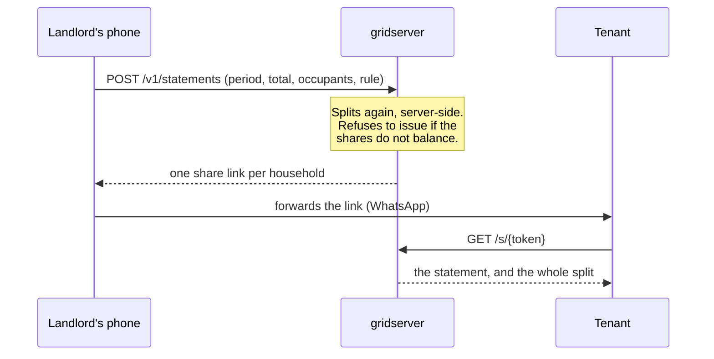
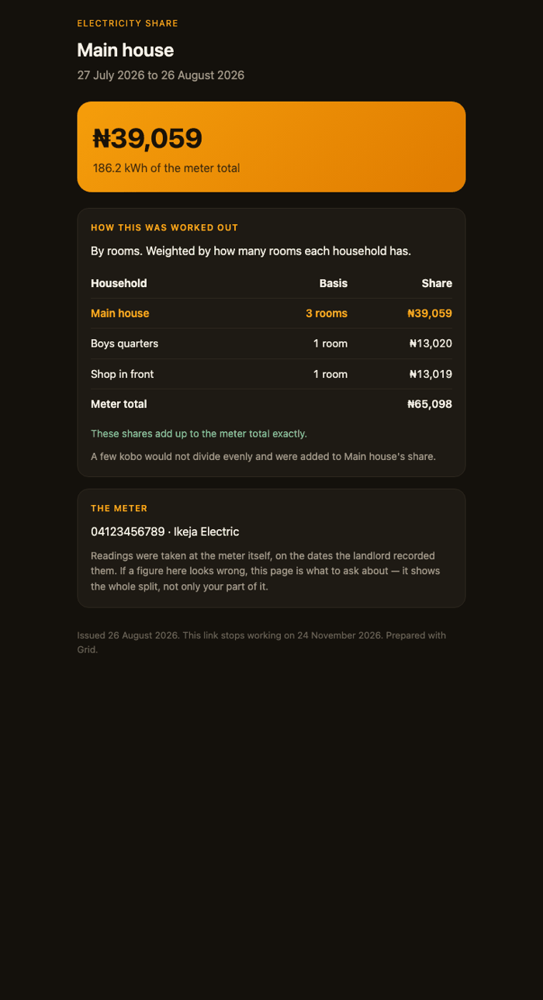

# Grid — server

The backend half of [Grid](../README.md). It exists for one reason, written
into the roadmap before any of it was built:

> A second person has to be able to read what the first person recorded.

Everything the phone does is offline and stays offline. This is the only part
of the product that needs a network, and it needs one because a **tenant** must
be able to see the share they are being asked to pay — without installing an
app, creating an account, or being asked to trust arithmetic they cannot check.

---

## 1. What it does

A landlord's phone splits a shared meter's bill between the households behind
it. That split is already correct on the device; what it cannot do is show it
to anybody else. This server takes the same inputs, **performs the split
again with its own copy of the engine**, and issues one unguessable link per
household.



The split happens **here**, not on the client, and not because the landlord is
suspected of anything. The server is what the tenant is shown, and a statement
whose arithmetic was done somewhere else cannot be checked by the person being
asked to pay it.

If the shares ever fail to sum to the meter total, nothing is issued at all.

---

## 2. The tenant's entire experience

<p align="center">
  
</p>

One URL. No account, no login, no app, and no JavaScript — the page is
server-rendered HTML with the CSS inline, because the audience opens it on a
mid-range Android over a metered connection and every kilobyte is one they paid
for. It works in a WhatsApp in-app browser and on whatever a two-year-old
handset ships as a default.

**The whole split travels with it**, not just the reader's own number. A tenant
who can see only their own figure is being asked to trust the arithmetic;
being able to check it against everyone else's is the entire point of the
feature. The page states in words that the shares balance, and names whoever
absorbed the indivisible remainder.

---

## 3. What each package does

### `internal/allocation` — the split, and its invariant

A second implementation of the engine that already exists in Dart at
[`app/lib/domain/services/allocation_engine.dart`](../app/lib/domain/services/allocation_engine.dart),
and it is duplicated on purpose. The figures must be identical whether a
landlord works them out on a phone with no signal or the server produces a
statement, and two implementations that disagree by a kobo would be worse than
having one. They are held to the same invariant and pinned to the same
fixtures by `TestMatchesDartFixtures`.

> **The shares always sum to the total. Exactly.**

Largest-remainder, in **whole naira**. Both halves of that matter, and the
second was learned by looking at real output — see [§5](#5-correctness-notes).

### `internal/statement` — what a tenant receives

The statement, the share token, and the money formatting.

The token is 32 bytes from `crypto/rand`. It is the only thing between a
stranger and somebody's electricity bill, so it is not a UUID, not a counter,
and not derived from anything in the record. Links expire after ninety days: a
capability URL living indefinitely in a forwarded WhatsApp thread is a
disclosure waiting for the thread to move.

### `internal/store` — persistence, landlord-scoped by construction

Every landlord-scoped method takes `landlordID` as its **first argument**, so a
forgotten scope is a compile error rather than a data leak. Cross-landlord
access returns not-found rather than forbidden — a 403 confirms the statement
exists.

`ByToken` is deliberately *not* landlord-scoped: it is what a tenant with no
account uses, and the token is the entire authorisation.

`ErrExpired` is distinct from `ErrNotFound`, which is a product decision rather
than a tidiness one. "Ask whoever sent this for a new link" is actionable;
"this does not exist" sends somebody to argue about the wrong thing.

### `internal/api` — two audiences, opposite needs

A landlord authenticates and issues. A tenant holds a link and reads. The
tenant path carries `Cache-Control: no-store`, `Referrer-Policy: no-referrer`
and `X-Robots-Tag: noindex` — a share link is a capability, and letting a proxy
cache it or a crawler index it is the same disclosure as forwarding the
message.

The request log rewrites `/s/{token}` before writing it. A share link in a log
file is the same disclosure one layer down.

---

## 4. Quick start

```bash
docker compose up --build
```

Statements live in memory, so this comes up with no database to provision and
nothing to migrate — the right default for something whose purpose is to be
clicked on. A restart loses issued links; Postgres goes behind the same
`store.Store` interface when that matters, and the port exists precisely so
that swap is a constructor change with no handler moving.

Issue a split:

```bash
curl -s -X POST localhost:8080/v1/statements \
  -H 'Authorization: Bearer change-me' \
  -H 'Content-Type: application/json' \
  -d '{
    "meter_number": "04123456789",
    "disco": "Ikeja Electric",
    "period_start": "2026-07-27T00:00:00Z",
    "period_end":   "2026-08-26T00:00:00Z",
    "rule": "byRooms",
    "total_kobo": 6509800,
    "total_energy_milli": 310400,
    "occupants": [
      {"id":"a","name":"Main house","rooms":3},
      {"id":"b","name":"Boys quarters","rooms":1},
      {"id":"c","name":"Shop in front","rooms":1}
    ]
  }'
```

Then open any `share_url` from the response in a browser. That is the whole
tenant flow.

```bash
go test ./...      # includes phase 6's exit gate, as a test
```

---

## 5. Correctness notes

### Exact shares that visibly did not add up

The engine allocated in kobo, which is arithmetically correct and produced
figures nobody could settle. A ₦65,098 bill split three ways by rooms gave
390,5880 / 130,1960 / 130,1960 kobo — exact to the kobo, and rendered on the
page as **₦39,058, ₦13,019 and ₦13,019**, which add up to ₦65,096.

So the statement claimed the shares balanced while showing three numbers that
did not. It is hard to imagine a worse failure for a document whose entire
purpose is to end an argument about arithmetic.

Nobody pays eighty kobo. Allocation now happens in whole naira, with any
sub-naira tail on the total handed to one household and named, so the figures
are settleable *and* visibly correct. Both engines changed together, and both
suites assert every share is a whole number of naira.

This was found by looking at a rendered page, not by a test. The kobo-level
invariant had been green throughout.

### The same amount, formatted two ways

Go truncated where Dart rounded, so the server would have shown ₦39,058 beside
an app showing ₦39,059. A tenant disputing a statement against their
landlord's phone, caused entirely by us. Both now round, in integer space.

### Not-found is not always the right refusal

Three cases return three different things on purpose: an unknown token is
not-found, an aged-out link is `410 Gone` with a page that says to ask for a
new one, and another landlord's statement is not-found rather than forbidden.
The last is a security decision — a 403 confirms the record exists — and the
middle one is a product decision.

---

## 6. Layout

```text
cmd/gridserver/        the binary; also self-healthchecks, because the image
                       is `scratch` and has no shell for a container probe
internal/allocation/   the split, and its invariant — mirrored from the Dart
internal/statement/    what a tenant receives, and the share token
internal/store/        persistence port + in-memory implementation
internal/api/          HTTP handlers, and the tenant-facing pages
migrations/            reserved for the Postgres implementation
Dockerfile             static binary on scratch, vet + tests as build steps
compose.yaml           one service, no database to provision
```

---

## 7. Status

| Component | State |
| --- | --- |
| Allocation engine, mirrored from Dart | Done — pinned to shared fixtures |
| Exact-sum invariant | Done — 2,000 randomised property trials |
| Whole-naira settlement | Done — shares are payable and visibly balance |
| Statement issue, list, revoke | Done |
| Share tokens: 32-byte, expiring, revocable | Done |
| Tenant page: no account, no app, no JavaScript | Done — phase 6's exit gate, asserted by test |
| Capability hygiene: no cache, no index, no referrer, not logged | Done |
| Landlord API keys | Done — from the environment; one landlord per deployment |
| Container: static binary, non-root, self-healthchecking | Done |
| Postgres implementation behind `store.Store` | Not started — the port exists, the adapter does not |
| Delta sync of facts from the phone | Not started |
| Landlord console screens in the app | Not started — statements are issued over the API today |
| Multi-landlord accounts, sessions, roles | Not started |
